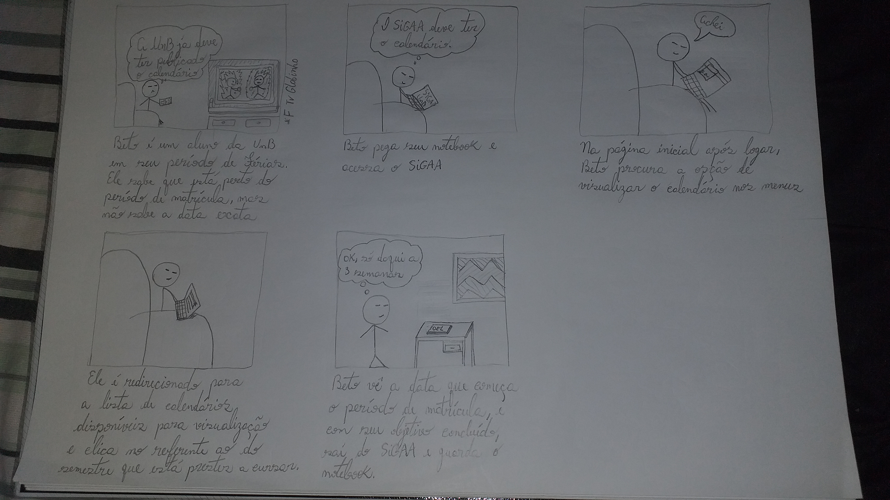
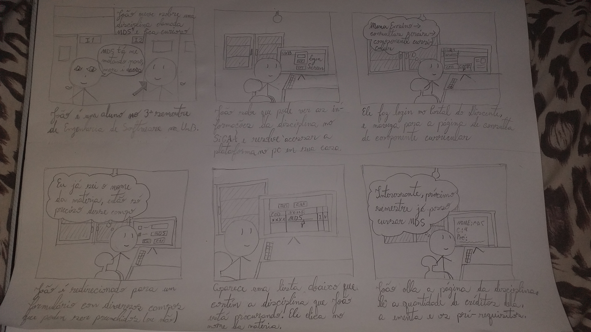
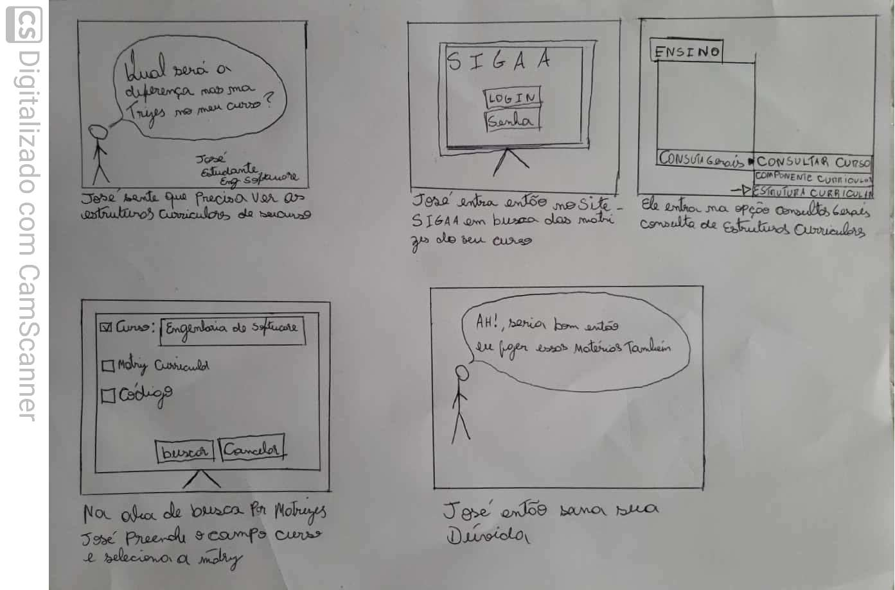

# Storyboard

## O que é

Storyboard é uma técnica de prototipação de baixa-fidelidade, focado nas tarefas que serão realizadas pelo usuário. Esse enfoque deve ser a primeira prioridade na construção da interface do sistema, uma vez que sistemas interativos são feitos para auxiliar nas tarefas dos usuários.

Por ser uma forma de prototipação de baixa-fidelidade, é necessário menor custo e tempo para sua criação, além de ser de fácil modificação, dessa forma contribuindo para uma melhor análise das ideias propostas para o sistema interativo.

Vale ressaltar que o mais importante em um storyboard é o entendimento das tarefas realizadas, e não a qualidade do desenho em si.

É recomendado que um storyboard conte com os seguintes elementos:

* Pessoas envolvidas
* Ambiente
* Tarefa a ser desempenhada
* Passos necessários
* O que levou a pessoa a usar a aplicação
* Qual tarefa está sendo ilustrada
* O que motiva as pessoas a usar o sistema?
* Quais tarefas o sistema auxilia as pessoas a completar?
* Qual necessidade o sistema resolve?

_Os Storyboards contidos neste documento são baseados nas tarefas das Análises de tarefas. Em alguns casos, as tarefas no storyboard estão com pequenas modificações baseadas em melhorias pensadas pelos autores._

### Storyboard 1 - Visualizar Calendário Acadêmico

Autor: Wagner

### Storyboard 2 - Visualizar Componente Curricular

Autor: Wagner

### Storyboard 3 - Visualizar Estrutura Curricular

Autor: Murilo

### Storyboard 4 - Visualizar Histórico

Autor: Murilo

## Histórico de Revisões

| Autor | Versão | Data(dd/mm/aaa) | Descrição
|-|-|-|-
Wagner Martins | 1.0 | 26/10/2020 | Adição de informações sobre o que é storyboard
Wagner Martins | 1.1 | 26/10/2020 | Adição dos storyboards

## Referências
* Storyboards, Paper Prototypes and Mockups - Scott Klemmer / Univ. Califórnia em Berkeley (Coursera) <https://www.youtube.com/watch?v=h2H3oIQtddU>
* PREECE, Jenny; ROGERS, Yvonne; SHARP, Helen; Design de Interação. 2005
